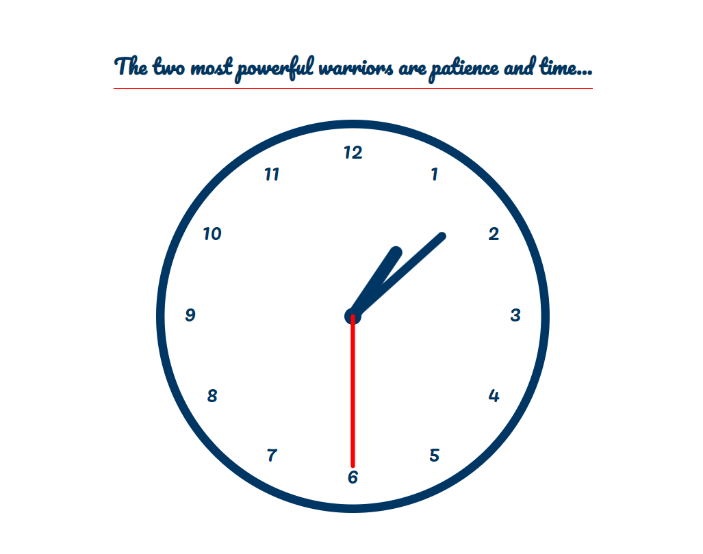

# 🕰️ New Tab Clock Chrome Extension (React + TypeScript)

A simple and elegant Chrome extension that replaces the new tab page with a real-time analog clock, built using **React**, **TypeScript**, and **SVG**. It also features stylish Google Fonts and a clean design.

 <!-- Replace with an actual screenshot if you want -->

---

## 🚀 Features

- 🕐 Beautiful analog clock with moving hour, minute, and second hands
- 🔢 Hour markers (1–12) around the clock face
- 🌐 Replaces Chrome's default new tab with a custom clock
- 🎨 Styled with Google Fonts and CSS
- ⚛️ Built with **React** + **TypeScript**
- 🖼️ SVG-based clock — no images, pure code

---

## 🛠️ Tech Stack

- **React.js**
- **Vite**
- **TypeScript**
- **SVG** for the clock design
- **CSS** for styling
- **Google Fonts** for a modern look

---

## 🧑‍💻 Setup & Installation

1. **Clone this repository**

```bash
git clone https://github.com/ankitraminwar/clock-extension-app.git
cd clock-extension-app
```
